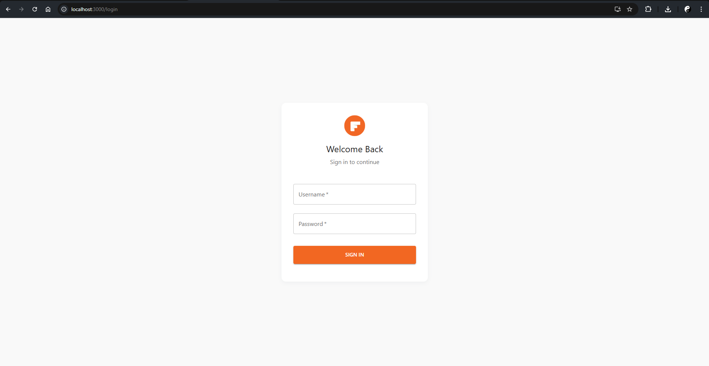
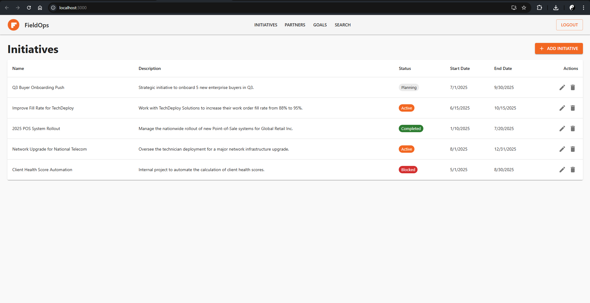
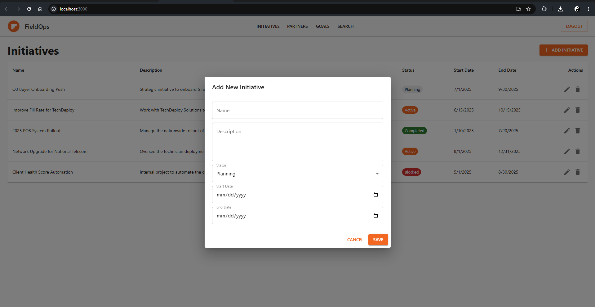
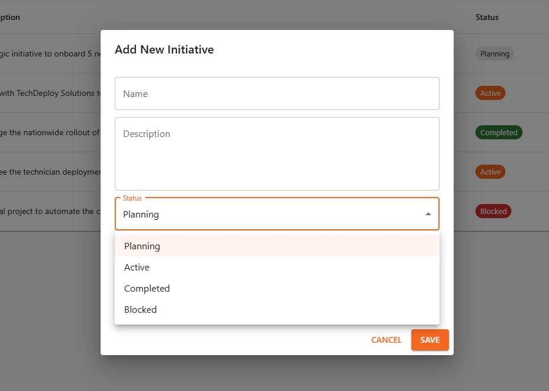

# FieldOps — Project/Initiative Tracker

A full-stack web application designed to streamline project management, track key initiatives, and manage partner relationships in a single, unified platform. This application provides a centralized hub for collaboration and monitoring. (Screenshots below)

## Key Features

- **Initiative Management:** Create, update, and delete project initiatives with status tracking (e.g., Planning, Active, Completed).
- **Partner & Vendor Hub:** A centralized place to manage partner information and link them to specific projects.
- **Goal & KPI Tracking:** Define and monitor SMART goals with percentage-based progress tracking.
- **Secure Authentication:** A robust login system to protect application data.

## Technology Stack

This project is built with a modern, containerized architecture:

- **Frontend:** React 18 (with Hooks), React Router for navigation, Standard CSS3 for styling
- **Backend:** Node.js with Express.js, PostgreSQL for the database, JWT (JSON Web Tokens) for secure authentication
- **Deployment:** Docker & Docker Compose for containerization

## Getting Started

To run this application on your local machine, you will need to have Docker and Docker Compose installed.

1. **Clone the repository:**

   ```bash
   git clone https://github.com/meraj-music/FieldOps.git
   cd FieldOps
   ```

2. **Create the environment file:**

   In the project's root directory, create a file named `.env` and copy the following (this file holds the database credentials):

   ```bash
   POSTGRES_USER=admin
   POSTGRES_PASSWORD=yoursecurepassword
   POSTGRES_DB=FieldOpsDB
   DATABASE_URL=postgres://admin:yoursecurepassword@db:5432/FieldOpsDB
   JWT_SECRET=thisisareallystrongsecretkeyforjwt
   ```
   
4. **Build and run the application:**

   Use Docker Compose to build the images and start the containers:

   ```bash
   docker-compose up --build
   ```

5. **Access the application:**

   - The Frontend Web App will be available at [http://localhost:3000](http://localhost:3000).
   - The Backend API will be running at [http://localhost:5000](http://localhost:5000).

## Create Your First User

Since the database starts empty, you must register the first user by making a POST request to the API. Using a tool like Postman or `curl`, send a request to:

```
http://localhost:5000/api/auth/register
```

with the required JSON body (e.g., username, password). Using Postman:


---

Feel free to reach out or open an issue for support or contributions!

Screenshots:







